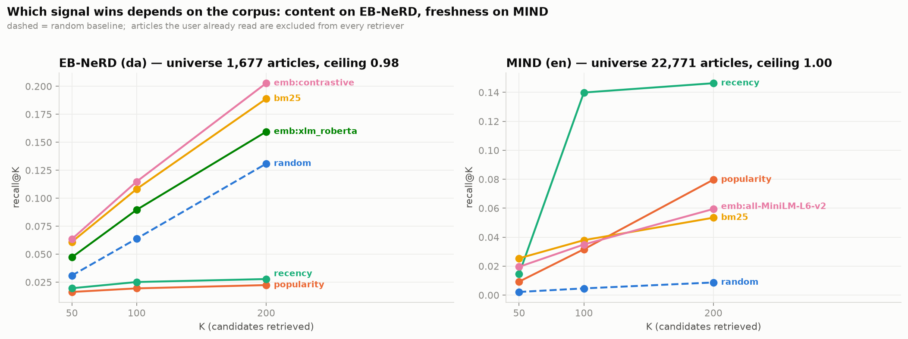
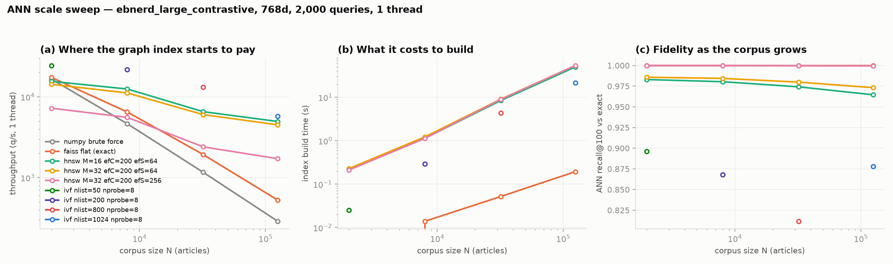

# Lexical & Semantic Retrieval on EB-NeRD and MIND

CS4.406 Information Retrieval & Extraction — Assignment 1.

One pipeline, two news-recommendation datasets, one schema: raw zips → cleaned parquet
feature store → temporal split → BM25 and embedding candidate generation → an evaluation
harness with bootstrap CIs and slices → Codabench submissions. Every number in the design
note and in the tables below is read out of a JSON written by the code that produced it,
so the prose cannot drift from the measurements.

| | EB-NeRD (Danish, Ekstra Bladet) | MIND (English, Microsoft) |
|---|---|---|
| articles (large) | 125,541 | 130,379 |
| impressions (train / test) | 12.1M / 13.5M unlabelled | 2.23M / 2.37M unlabelled |
| indexed text | title + subtitle (avgdl 15.7) | title + abstract (avgdl 31.7) |
| live candidate universe (7 d) | 2,063 | 29,309 |

Design note: [`reports/design_note.pdf`](reports/design_note.pdf) (4 pages).
Systems ablation reports (`reports/l2/` … `reports/l5/`) are reproducible via `make l2` … `make l5`
(gitignored — regenerated, not shipped).

---

## 1. Results

### Leaderboards (Codabench, hidden test set)

| competition | submission | score | note |
|---|---|---|---|
| [MIND](https://www.codabench.org/competitions/13967/) | decayed popularity | **0.4900** | three uploads, identical — below chance |
| MIND | semantic (MiniLM, mean-pooled history) | **0.6496** | +32.6% over popularity |
| [RecSys 2024 / EB-NeRD](https://www.codabench.org/competitions/2469/) | popularity + semantic | no score returned | organiser-run queue, ~8 days of backlog; diagnosed in §8 of the design note |

Screenshots: [`reports/leaderboard/`](reports/leaderboard).

The popularity result is a finding, not a failure. It scores 0.5440 on dev and 0.4900 on
the hidden test set, because the prior is counted strictly before a cutoff that the test
week runs up to seven days past: 85.8% of candidate slots score exactly 0 and 31.4% of
rows are a complete tie. The same rows ranked by content instead leave 1.0% of slots at
zero. A stale prior does not degrade gracefully — it stops being a ranking.

### Retrieval — recall@K (test split, large variants, live universe, seen articles dropped)

Ceiling is the share of clicks reachable inside the candidate universe at all:
0.9769 (EB-NeRD), 1.0000 (MIND).

| method | EB-NeRD @50 | @100 | @200 | MIND @50 | @100 | @200 |
|---|---|---|---|---|---|---|
| random | 0.0233 | 0.0473 | 0.0946 | 0.0018 | 0.0034 | 0.0070 |
| popularity (prior) | 0.0169 | 0.0197 | 0.0230 | 0.0101 | 0.0585 | 0.0805 |
| recency | 0.0143 | 0.0246 | 0.0271 | 0.0023 | 0.0031 | 0.0187 |
| BM25 | 0.0428 | 0.0846 | 0.1577 | **0.0207** | **0.0332** | **0.0485** |
| embeddings | **0.0581** | **0.1069** | **0.1900** | 0.0159 | 0.0283 | 0.0482 |

Which retriever wins is a fact about the candidate pool, not about the language. Open
EB-NeRD's window to its whole catalogue and BM25 wins there too; shrink MIND's to a day
and embeddings win. At matched pool sizes the two datasets agree.


*Small-variant sweep (same finding as the large-variant table above): content wins on
EB-NeRD, freshness wins on MIND.*

### Ranking — official metrics inside each impression's real candidate list (large, test)

95% CIs from bootstrap over impressions; `random` is the calibration check.

| ranker | EB-NeRD AUC | nDCG@10 | ILD@10 | cov@10 | MIND AUC | nDCG@10 | ILD@10 | cov@10 |
|---|---|---|---|---|---|---|---|---|
| random | 0.4999 | 0.4298 | 0.772 | 0.910 | 0.4992 | 0.2859 | 0.945 | 0.684 |
| pop_prior | 0.4274 | 0.3804 | 0.756 | 0.881 | 0.5450 | 0.3132 | 0.918 | 0.344 |
| ctr_prior | 0.4244 | 0.3795 | 0.755 | 0.931 | 0.6044 | 0.3546 | 0.963 | 0.333 |
| recency | 0.5009 | 0.4208 | 0.778 | 0.836 | 0.5140 | 0.2957 | 0.939 | 0.584 |
| bm25 | 0.5275 | 0.4520 | 0.762 | 0.897 | 0.5751 | 0.3535 | 0.895 | 0.682 |
| emb | **0.5462** | **0.4666** | 0.673 | 0.891 | **0.6360** | **0.3935** | 0.829 | 0.660 |
| hybrid_rrf | 0.5456 | 0.4636 | 0.707 | 0.894 | 0.6259 | 0.3851 | 0.853 | 0.679 |
| *pop_oracle** | *0.6547* | *0.5331* | *0.774* | *0.821* | *0.5934* | *0.3700* | *0.920* | *0.236* |

`pop_oracle*` (Q9 anti-gaming control): same ranker, but counting clicks from inside the
scored split — +47% AUC on EB-NeRD, +12% on MIND. Structurally blocked by
`tests/test_no_leakage.py`.

The beyond-accuracy columns cut against the accuracy ones. The embedding ranker has the
lowest intra-list diversity on both datasets — it is accurate because it is narrow. Prior
popularity is the opposite failure: on MIND it reaches 34% of the catalogue and scores
0.430 on head impressions against 0.240 on tail ones. Whatever ships needs a diversity
constraint that no accuracy metric will ask for.

---

## 2. Design decisions, and the alternative each one beat

| decision | alternative | why, measured |
|---|---|---|
| polars, lazy + streaming | pandas (the starter notebooks) | EB-NeRD large is 13.5M test impressions / 206M candidate slots; the pandas path does not survive it on one box |
| BM25 over a polars postings table → scipy CSR; query = whole history as one sparse row | per-query loop over an inverted index | all 73,152 MIND queries are one matrix product `H·TF`; stemming runs once per distinct token, not per occurrence |
| exact `IndexFlatIP` at the operating point | HNSW everywhere | crossover measured at N≈8,000 — below it a graph walk costs more than the matmul it replaces |
| candidate universe = 7-day live window anchored at split start | whole catalogue; window anchored at split end | EB-NeRD carries articles from 1993; anchoring at the end excludes everything already popular when the week began, and scored popularity at exactly 0.0000 |
| drop already-read articles from the retrieved list | keep them | BM25's top hit was frequently an article from the user's own history; excluding them lifts EB-NeRD recall@50 by +38% |
| title + abstract as the indexed text | + body (EB-NeRD only) | adding the body costs −9% recall for 11× the postings |
| official MRR (mean 1/rank over every click) | reciprocal rank of the first click | tested against the graders' `ebrec` code; MIND is 28.8% multi-click, so the first-click variant overstated it by 15% |
| row order is part of the schema (`src_row`) | group by `impression_id` | EB-NeRD's 200,000 beyond-accuracy rows all share `impression_id = 0`; grouping collapses them and no sort recovers the order |

---

## 3. Ablations

### 3a. Retrieval and ranking knobs (Q2–Q4)

| knob | swept over | shipped | what sweeping it was worth |
|---|---|---|---|
| BM25 (k₁, b) | 4×4 grid + BM25L | k₁=2.0, b per corpus | b: **+70%** recall@100 on MIND, 2.3% total spread on EB-NeRD; the optimum **reverses** between small and large |
| ANN index | flat, HNSW (M, efC, efS), IVF, SQ8, PQ | exact `IndexFlatIP` | exact below N≈8K; HNSW **9.4×** faster at 125K for 96.5% fidelity |
| history window | n_recent ∈ {5…100, all} × decay | all, no decay | +23% (EB-NeRD BM25) vs the 30-click window it replaced |
| similarity cutoff | global τ, per-user α·best | none (fixed top-200) | +11% / +12% at matched budget — measured, not adopted |
| stored features | 10 user/article features | embeddings + category_match | +5.9% AUC (EB-NeRD), +0.4% (MIND) |
| query-term saturation k₃ | {∞, 1000, 32, 8, 2, 0} | ∞ (none) | binarising the query costs −56% (EB-NeRD) |
| tokeniser | stop × stem × field | stop + stem | stopwords −10% / −26% recall if kept |
| user representation | 1 vector vs k chunks / k-means | 1 mean-pooled vector | +3.8% (k=2) — not adopted, gain inside the noise of its cost |
| augmented history | shipped vs augmented | shipped | <0.31% nDCG@10 either way; worth having because it came back negative |


*(a) exact search beats HNSW below N≈8,000 on raw throughput; (b) HNSW's build cost is
the same order as brute force up to 100K articles; (c) HNSW trades ~2 points of recall@100
for that speed once it does win.*

### 3b. Systems ablations

Each of these tests a claim from the systems literature, against this corpus, on the engineering
metric the claim is about. Full write-ups in `reports/l*/l*_ablation.md`.

| subsystem | shipped | alternatives measured | engineering metric | verdict |
|---|---|---|---|---|
| service demand | one process, 48 leaf threads | 1 → 48 servers | `D_total` = 9.19 ms, bottleneck `ann_search` (8.96 ms) | 110 → **467 q/s** (4.23×); the serial-throughput prediction lands within 1.5% and Little's law within 1.3% |
| queueing model | — | M/M/1 vs M/D/1 vs measured | service CV = 0.01 | **M/D/1**, not M/M/1 — M/M/1 over-predicts wait 1.9× |
| tail latency | no hedging | hedged requests, per-leaf budgets | p99 under load | **−86%** on an idiosyncratic tail, **+204%** on a shared one — a retry storm, not a fix |
| shard skew | doc-ranged shards | micro-sharding n ∈ {16,64,128} | biggest-shard share, p50 | **made it worse**: 29.6%→18.4% share but p50 5.51→8.50 ms |
| index updates | wholesale rebuild | append-in-place, LSM segments | seconds/week at equal bytes and recall | rebuild 301.6 s, **append 8.8 s**, segments 41.0 s → **switch to append** |
| storage layout | vectors in RAM | cold NVMe, random vs sequential | MB/s at fixed volume | cold 1,477 MB/s vs warm 5,934; random penalty up to **93×** |
| compression | uncompressed parquet | snappy, lz4, zstd | cold read time | zstd **2.7× smaller, 1.7× slower** — decode, not fetch, is the bottleneck |
| near-duplicates | none | SHA-256, shingling, MinHash+LSH | share of catalogue, recall@100 | **2.2%** of articles, **0.076%** of clicks → +0.0003 recall. Ship the SHA-256 pass (0.12 s) and nothing else |
| Zipf / Heaps | assumed | fit both, predict held-out | slope, vocabulary error | slope −1.07 ✓; Heaps as a **predictor** overshoots vocabulary by **+53.6%** |
| seen-set | exact hash set | Bloom at 4–16 bits/key | bytes, recall@100 | 16 b/key: **0.25× bytes for −0.00002 recall** → ships when users grow |
| frequency sketch | — | Count-Min vs Count-Sketch | mean abs error on a Zipf stream | **Count-Sketch wins 2.9×** — the slide's ordering inverts under skew |
| field weighting | title ×1 (concatenated) | title ×1/2/3/5 | recall@200 | ×5 → **−3.7%** — monotonically worse for a history-bag query |
| query processing | one sparse matmul | TAAT, DAAT, DAAT+WAND | postings touched, multiply-adds, ms | WAND is rank-safe and prunes **0%→66%** with query length, but does half the arithmetic and cannot beat BLAS at 2,063 docs |
| ↳ at scale | — | 7 d → whole catalogue (61×) | WAND's share of matmul work | 2.1× → **6.6×** — the crossover is at ~5× this catalogue, i.e. the query path breaks at 10× the **universe**, not 10× the users |
| posting codes | raw uint32 | v-byte, bit-packed, Elias-γ, Roaring | bits/gap, decode GB/s | all **40–100% worse** than the slide's table (median gap 129); break-even needs a **2.5 GB/s** decoder, numpy gives 0.09 |
| index build | single-pass in RAM | SPIMI, 20k / 5k-doc blocks | peak RSS delta | **869.6 MB → 0.8 MB** for 1.3× the time → switch to SPIMI |
| candidate tier | full universe | 5–50% popularity tier | recall@100, docs scored | 5% tier: **+222%** recall@100 (0.0869 → 0.2799) scoring **20× fewer** docs — cheaper *and* better |
| skip lists / term order | — | √L skips; ascending vs descending df | merge steps | **10.9×** mean speedup; cheapest-first saves **87%** of steps |

Eight measurement bugs were caught in the harness before they became results — a cold read
served warm by a live memmap, a hedge that never cancelled its twin, a MinHash whose *k*
permutations were all the same permutation, a timer that included its own setup. A result
is only as good as the rig that produced it.

### 3c. What changed in the code because of the above

1. **Append to the ANN index instead of rebuilding it** — 30× cheaper per week, same bytes, same recall.
2. **Build the inverted index with SPIMI** — removes a linear-in-corpus memory failure mode for 1.3× the time.
3. **Add a 5% popularity tier** to the candidate universe — not a quality trade, a quality win.
4. **Bloom-filter the seen-set** at 10–16 bits/key once the user count grows.
5. **Keep** the matmul, weight-1 fields, no positions, no compression and no dedup pass — each of those is now a number rather than a habit.

---

## 4. Where this breaks at 10×

| what breaks | why | the fix |
|---|---|---|
| the id-remap join | explode → join → group_by hit 120 GB on EB-NeRD large; 200k beyond-accuracy rows share `impression_id = 0` | in-place `list.eval(replace_strict)`, peak RSS 8.9 GB |
| feature freshness | popularity is frozen at the split boundary on a corpus whose median clicked article is 80 h younger | rolling in-window update with a strictly causal cutoff — real work, not a parameter |
| exact search | crossover at N≈8K; the 125K corpus already wants HNSW | HNSW; the 42 s single-threaded build becomes the new bottleneck |
| the BM25 matmul | `H·TF` stops fitting at 10× users × 10× vocabulary | blocked product, or WAND once the universe (not the user count) grows ~5× |
| index build memory | single-pass in RAM is linear in the corpus | SPIMI (measured: 1000× less peak RSS) |
| single node | one box, one GPU; no replication | the one L2 item a single machine cannot measure, stated as a gap rather than estimated |

---

## 5. Reproducing

```bash
uv sync                      # environment
make ebnerd mind-small       # download + normalise the bundles
make reproduce               # raw files -> every number, table and figure
```

`make reproduce` is `data → test → q2 → q3 → ann → q4 → q4-ablation → baseline → figures
→ note`, at dev scale. `bash scripts/run_large.sh` runs the identical pipeline at Codabench
scale; every step is logged and isolated, so one failure does not abandon the rest. The
systems ablations are deliberately not in `reproduce` — they need the large bundle to mean
anything, and run as `make l2` / `l3` / `l4` / `l5`.

| target | question | writes |
|---|---|---|
| `make data` / `data-large` | Q1 | `data/processed/<ds>/<variant>/` feature store |
| `make test` | Q1, Q9 | behaviour-window, leakage and submission-format assertions |
| `make q2` | Q2 | `reports/q2/` — BM25 + the (k₁, b) grid |
| `make q3` | Q3 | `reports/q3/` — semantic retrieval, worked examples |
| `make ann` | Q3 | `reports/q3/ann_*.json` + `ann_ablation.md` |
| `make threshold` / `userrep` / `features` / `multi` | Q3, Q4 | the knob sweeps in §3a |
| `make q4` / `q4-ablation` | Q4, Q9 | `reports/q4/` + `q4_results.md` |
| `make baseline` | Q5 | `reports/sub/*.zip` for both leaderboards |
| `make l2` … `make l5` | systems ablations | `reports/l*/` + one `*_ablation.md` each |
| `make figures` | Q2–Q4 | `reports/figures/` |
| `make note` | Q6 | `reports/design_note.{html,pdf}`, asserting the 4-page limit |
| `make ai-log` | Q7 | `reports/ai_usage_log.md` |

Data, the virtualenv and both package caches are reached through symlinks and never live
in the repo; `DATA_ROOT=/some/path make ebnerd` overrides the location.

---

## 6. Layout

```
src/newsrec/          the pipeline
  config, schema      canonical article/impression/history schema; per-dataset configs
  ingest_ebnerd/mind  raw -> unified parquet
  ids, build, store   dense id spaces, stage-cached build, feature store
  features            user recency/activity, article CTR and decayed clicks
  lexical, retrieval  BM25 over a polars postings table -> scipy CSR
  semantic, embeddings FAISS + article vectors
  evaluate, baselines the metric harness and the reference rankers
  submit              leaderboard files, in raw row order
scripts/              one entry point per question, plus the l2-l5 ablation harnesses
tests/                leakage, row order, official metrics, submission format
configs/              one YAML per dataset variant
reports/              JSON results, generated markdown, figures, design note
```

### Deliverables map

| assignment item | where |
|---|---|
| Q1 pipeline | `src/newsrec/{config,schema,ingest_*,ids,build,features,store}.py` |
| Q2 BM25 | `src/newsrec/lexical.py`, `scripts/q2_bm25.py` |
| Q3 semantic + ANN ablation | `src/newsrec/semantic.py`, `scripts/q3_{semantic,ann}.py` |
| Q4 harness | `src/newsrec/evaluate.py`, `scripts/q4_eval.py` |
| Q5 submissions | `src/newsrec/submit.py` → `reports/sub/` (gitignored; `make baseline`) |
| Q6 design note | `reports/design_note.pdf` |
| Q7.3 leaderboard screenshots | `reports/leaderboard/` |
| Q7.4 AI usage log | `reports/ai_usage_log.md` |
| Q9 leakage tests | `tests/test_no_leakage.py` |

---

## 7. Pipeline conventions worth knowing

**Temporal split.** The last editorial day of each official *train* week becomes `val`; the
official validation split becomes a labelled, fully held-out `test`; the official test set
stays the unlabelled `submit` split. Strictly increasing, and the official splits keep
their published meaning.

| | train | val | test | submit |
|---|---|---|---|---|
| EB-NeRD | 05-18 07:00 → 05-24 07:00 | 05-24 → 05-25 07:00 | 05-25 → 06-01 | 06-01 → 06-08 |
| MIND | 11-09 → 11-14 | 11-14 | 11-15 | 11-16 → 11-22 |

EB-NeRD's editorial day runs 07:00→07:00, so one day spans two calendar dates — and no
session straddles the cut, because that boundary *is* the day break. MIND's raw timestamps
are `%m/%d/%Y %I:%M:%S %p`, which sort wrong as strings.

**Stage caching knows about code.** A stage is reused only when the config hash, the hash of
the build-relevant modules and the raw-input inventory all match the manifest. Hashing the
config alone meant editing `features.py` and silently keeping the old logic.

**Leakage rules the tests enforce.** Splits strictly ordered with no boundary overlap; every
derived feature's `computed_through` stamp earlier than the split it describes; exposure
counts equal to the totals of splits that end before it; `article_stats` carrying no
cross-split counts; `next_read_time` / `next_scroll_percentage` never entering the store;
augmented history appending only pre-cutoff clicks without deduplicating what shipped.

**Missing columns stay null.** MIND has no publication date (`first_seen_time` is derived
from its earliest impression) and no history timestamps; EB-NeRD has no Wikidata entities.
Nothing is faked to make the two datasets look alike.

**`read_time` and `scroll_percentage` are a deliberate grey zone.** Both ship fully populated
in the unlabelled test sets, so the leaderboards permit them, but they describe a visit still
in progress at prediction time. They are stored, flagged, and excluded from every ranker here.

## 8. Data

| bundle | articles | impressions |
|---|---|---|
| `ebnerd_demo` | 11,777 | 24,724 train / 25,356 val |
| `ebnerd_small` | 20,738 | 232,887 / 244,647 |
| `ebnerd_large` | 125,541 | 12,063,890 / 12,566,385 |
| `ebnerd_testset` | 125,541 | 13,536,710 unlabelled |
| `MINDsmall_{train,dev}` | 51,282 / 42,416 | 156,965 / 73,152 |
| `MINDlarge_{train,dev,test}` | 101,527 / 72,023 / 120,961 | 2,232,748 / 376,471 / 2,370,727 |

Acquisition notes, all of which cost real time:

* **EB-NeRD's S3 bucket throttles a single connection to ~30 KB/s** from this network — a
  plain `wget` of the 6 GB of bundles needed ~30 h. `scripts/par_download.py` fans out over
  24 HTTP Range connections with per-chunk checkpointing, reaching 0.5–1.3 MB/s and resuming
  after a drop.
* `articles_large_only.zip` is at the **bucket root**, not under `artifacts/` as the
  assignment PDF says (that path 404s).
* **MIND is HuggingFace-gated**, and a token is not sufficient — the terms must be accepted
  once on the dataset page, or every resolve returns `403 GatedRepo`.
* Several archives unpack into a doubled directory and carry macOS `__MACOSX` cruft;
  `make normalize` (run automatically by both fetch scripts) flattens and cleans them.
